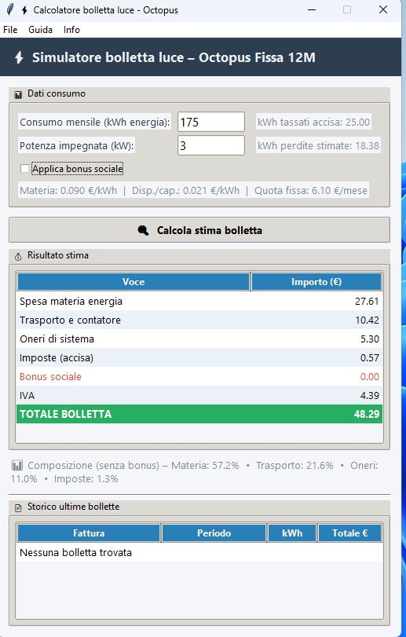

# ⚡ Calcolatore Bolletta Luce – Octopus


Software desktop per **stimare l'importo della bolletta elettrica** a partire dai consumi mensili in kWh, calibrato sui corrispettivi del contratto **Octopus Fissa 12M**.

---

## 📸 Screenshot



---

## 🎯 Funzionalità

| Funzione | Descrizione |
|---|---|
| **Calcolo stima** | Inserisci i kWh consumati nel mese e ottieni la stima dettagliata della bolletta |
| **Storico bollette** | Auto-scansione delle bollette PDF nella cartella dell'app, con visualizzazione di periodo, kWh e totale |
| **Importa bolletta PDF** | Legge una bolletta Octopus e propone l'aggiornamento automatico dei corrispettivi |
| **Impostazioni** | Modifica manuale di tutti i parametri economici (materia, trasporto, oneri, imposte, bonus) |
| **Bonus sociale** | Applica/disattiva il bonus sociale mensile |

### Voci calcolate

- **Spesa materia energia** – quota fissa + prezzo energia × kWh (incluse perdite di rete 10,5%)
- **Trasporto e gestione contatore** – quota fissa + quota potenza + quota energia + UC3 + UC6
- **Oneri di sistema** – componenti ASOS e ARIM
- **Imposte** – accisa (kWh eccedenti la soglia esenzione 150 kWh/mese) + IVA 10%
- **Bonus sociale** – sconto mensile (valore negativo)
- **Composizione percentuale** – ripartizione tra le voci (escluso bonus)

---

## 🚀 Installazione

### Opzione 1: Eseguibile standalone (consigliato)

1. Scarica la cartella `CalcoloBolletta` dall'ultima [Release](../../releases)
2. Lancia `CalcoloBolletta.exe`
3. Non serve Python installato

### Opzione 2: Da sorgente

**Prerequisiti:**
- Python 3.10+
- pip

```bash
# Clona il repository
git clone https://github.com/franknatale80/Calcolobolletta.git
cd Calcolobolletta

# Installa le dipendenze
pip install pdfplumber

# Avvia l'applicazione
python bolletta.py
```

### Opzione 3: Build dell'eseguibile

```bash
# Installa PyInstaller
pip install pyinstaller

# Build con lo spec file incluso
python -m PyInstaller CalcoloBolletta.spec --noconfirm

# L'exe sarà in: dist/CalcoloBolletta/CalcoloBolletta.exe
```

Per creare un **installer Windows** (setup autoestraente), installa [Inno Setup](https://jrsoftware.org/isinfo.php) e compila `CalcoloBolletta_setup.iss`, oppure lancia `build.bat` che esegue tutto automaticamente.

---

## 📖 Utilizzo

### Calcolo rapido

1. Inserisci il consumo mensile in **kWh** (lo trovi nella bolletta alla voce "Consumo fatturato")
2. Verifica che la **potenza impegnata** sia corretta (default: 3 kW)
3. Seleziona/deseleziona il **bonus sociale**
4. Premi **Calcola** (o `Invio`)

La tabella mostra ogni voce con il relativo importo e la riga **TOTALE BOLLETTA** evidenziata. In basso viene mostrata la composizione percentuale.

### Storico bollette

L'app cerca automaticamente i file `fattura-*.pdf` nella propria cartella e ne estrae:
- Numero fattura
- Periodo di fatturazione
- kWh consumati
- Totale in €

Lo storico è visibile nella tabella in basso e si aggiorna con il menu **File → Aggiorna storico bollette**.

### Importazione bolletta

Da **File → Importa bolletta (PDF)...** puoi selezionare un PDF di una bolletta Octopus. L'app confronta i corrispettivi trovati con quelli attuali e propone le variazioni in una finestra dove puoi selezionare quali applicare.

### Impostazioni

Da **File → Impostazioni...** puoi modificare tutti i parametri economici. Le modifiche vengono salvate nel file `config_bolletta.json`.

---

## ⚙️ Configurazione

Il file `config_bolletta.json` contiene tutti i parametri tariffari:

```json
{
    "materia": {
        "quota_fissa_mese": 6.1,
        "prezzo_materia_kwh": 0.09,
        "prezzo_disp_kwh": 0.021243
    },
    "trasporto": {
        "quota_energia_kwh": 0.0119,
        "quota_fissa_mese": 1.92,
        "quota_potenza_kw_mese": 1.96,
        "uc3_kwh": 0.00276,
        "uc6_fisso_kw_mese": 0.016567,
        "uc6_var_kwh": 7e-05
    },
    "oneri": {
        "arim_kwh": 0.001638,
        "asos_kwh": 0.028657
    },
    "imposte": {
        "accisa_kwh": 0.0227,
        "iva": 0.1,
        "soglia_esenzione_kwh_mese": 150.0,
        "coeff_perdite": 0.105
    },
    "bonus_sociale_mese": -62.16
}
```

| Parametro | Descrizione |
|---|---|
| `prezzo_materia_kwh` | Prezzo fisso dell'energia (€/kWh) |
| `prezzo_disp_kwh` | Corrispettivo di dispacciamento (€/kWh) |
| `quota_fissa_mese` | Quota fissa mensile per la materia (€/mese) |
| `accisa_kwh` | Accisa per kWh eccedente la soglia esenzione |
| `soglia_esenzione_kwh_mese` | Soglia esenzione accisa (150 kWh/mese per domestici residenti) |
| `coeff_perdite` | Coefficiente perdite di rete (10,5% = 0.105) |
| `bonus_sociale_mese` | Importo mensile bonus sociale (valore negativo) |

> **Nota:** Quando usi l'exe, la prima volta il config viene letto dal bundle; dopo la prima modifica, una copia viene salvata accanto all'exe e avrà sempre la priorità.

---

## 📊 Precisione

Il simulatore è stato confrontato con le bollette reali con risultati molto vicini:

| Bolletta | kWh | Reale | Stimato | Scarto |
|---|---|---|---|---|
| Feb 2026 | 178 | -19,42 € | -19,45 € | -0,2% |
| Gen 2026 | 191 | -23,78 € | -24,06 € | -1,2% |
| Dic 2025 | 175 | -27,89 € | -27,41 € | +1,7% |

Le piccole differenze sono dovute ad arrotondamenti riga per riga e ad eventuali aggiornamenti tariffari ARERA nel periodo.

---

## 📁 Struttura del progetto

```
Calcolobolletta/
├── bolletta.py                 # Applicazione principale (GUI + logica)
├── config_bolletta.json        # Parametri tariffari
├── CalcoloBolletta.spec        # Configurazione PyInstaller
├── CalcoloBolletta_setup.iss   # Script Inno Setup (installer Windows)
├── build.bat                   # Script di build automatico
├── fattura-*.pdf               # Bollette PDF (opzionali, per lo storico)
├── dist/                       # Output build (generato)
│   └── CalcoloBolletta/
│       ├── CalcoloBolletta.exe
│       └── _internal/
└── README.md
```

---

## 🛠️ Dipendenze

| Pacchetto | Versione | Scopo |
|---|---|---|
| **Python** | 3.10+ | Runtime |
| **tkinter** | incluso | Interfaccia grafica |
| **pdfplumber** | latest | Parsing delle bollette PDF |
| **PyInstaller** | 6.x | Build exe (solo per compilazione) |
| **Inno Setup** | 6.x | Installer Windows (opzionale) |

---

## ⚠️ Limitazioni

- La stima è calibrata sui corrispettivi **Octopus Fissa 12M** — per altri fornitori è necessario modificare i parametri nel config
- Il parsing PDF funziona con il formato specifico delle bollette Octopus Energy Italia
- Piccoli scostamenti (< 2%) rispetto alla bolletta reale sono normali per via degli arrotondamenti
- Non gestisce tariffe biorarie (F1/F2/F3) anche se il config prevede la struttura per future implementazioni
- Il totale potrebbe risultare negativo se il bonus sociale supera i costi effettivi

---

## 📄 Licenza

Software per **uso personale**. Verifica sempre i risultati con le bollette ufficiali del tuo fornitore prima di prendere decisioni economiche.

© Frank1980 – Home Computing – 2026
